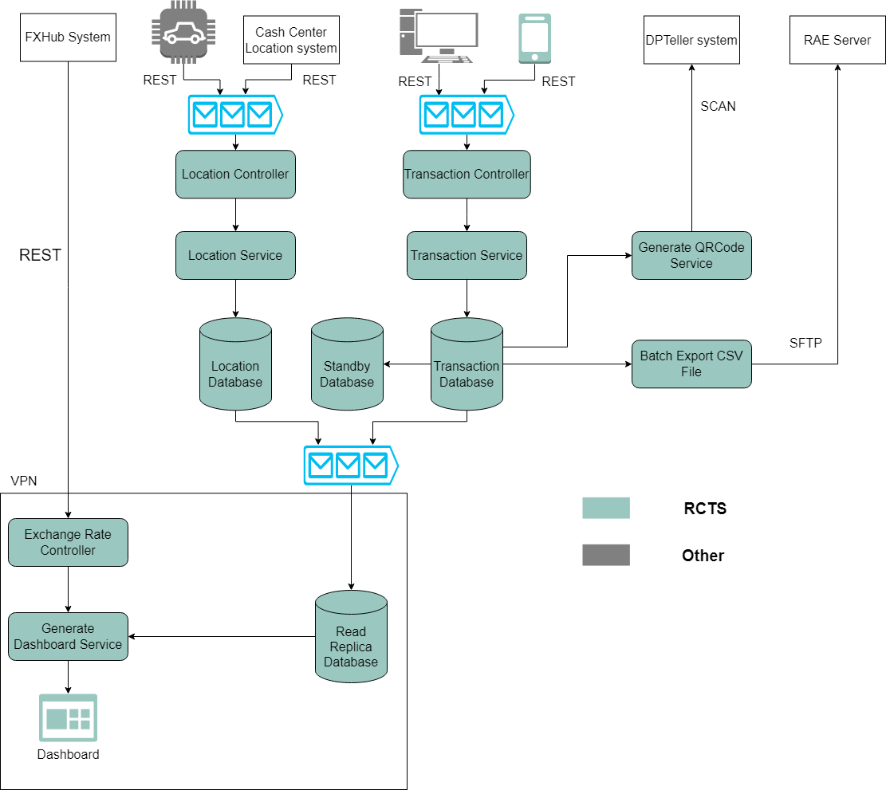

#RCTS System

##Index

1. [Context Diagram](#context-diagram)
2. [System Architecture Diagram](#system-architecture-diagram)
3. [REST API Flow](#rest-api-flow)

##Context Diagram


##System Architecture Diagram


##REST API FLOW
ระบบ REST API ทั้งหมดต้องผ่าน protocol OAuth 2.0 ก่อนถึงสามารถใช้งานได้
1. ระบบ IoT จากรถขนส่งเงินสดและระบบ Cash Center จะส่งข้อมูล Location โดยประกอบด้วยข้อมูล Latitude และ Longitude มาในรูปแบบ JSON

* **Request**

| Method | Url      | Description                             |
|--------|----------|-----------------------------------------|
| POST   | locaiton | ส่ง Latitude และ Longitude ให้ระบบ RCTS |

* **BODY**

```
{
    "lat": -25.363,
    "lng": 131.044
}
```

2. mobile application ของพนักงานขนส่งเงินสามารถ scan QRCode และส่งข้อมูลจำนวนเงินมาหา RCTS ในรูปแบบ JSON ได้

* **Request**

| Method | Url    | Description                 |
|--------|--------|-----------------------------|
| POST   | qrcode | ส่ง Id ของกล่องและจำนวนเงิน |

* **BODY**

```
{
    "id": 123456789,
    "amount": 2000000
}
```

3. ระบบ FXHub จะส่ง exchange rate มาทาง webhook ในรูปแบบของ JSON

* **Request**

| Method | Url      | Description                      |
|--------|----------|----------------------------------|
| POST   | exchange | ส่งสกุลเงินและอัตราการแลกเปลี่ยน |

* **BODY**

```
{
    "currency": "USD",
    "rate": 33.0512
}
```